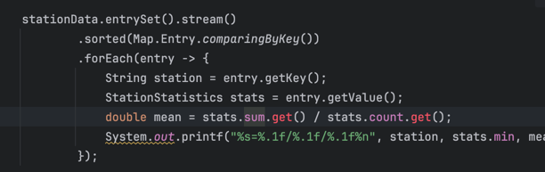

### Here's a Java program designed to process the described file with high performance using modern Java features.

It uses multithreading, efficient I/O operations, and modern Java Streams to achieve speed.

---

### Key Features

- **Threading**: Utilizes a custom `ForkJoinPool` for parallel processing of the file, maximizing CPU utilization.
- **Concurrency**: Uses a thread-safe `ConcurrentHashMap` and atomic variables for shared state without locks.
- **Modern Java**: Takes advantage of `Stream.parallel()`, `Files.newBufferedReader`, and `DoubleAdder`/`LongAdder` for high performance.
- **Input Handling**: Handles comments, malformed lines, and invalid temperature data gracefully.

---

### Usage

1. **Compile the program**:

   ```bash
   javac WeatherStationProcessor.java
   ```

2. **Run the program**:

   ```bash
   java useroptimized.WeatherStationProcessor <input_file>
   ```

---

### Assumptions

- The input file fits within the constraints of available disk and memory I/O.
- Java 20 or later is installed to support modern features and optimal GC performance.

---

Let me know if you need further adjustments or enhancements!

--- 

--- 

## Notes 

### Failed to compile

symbol:   method get()
[ERROR]   location: variable sum of type java.util.concurrent.atomic.DoubleAdder

symbol:   method get()
[ERROR]   location: variable count of type java.util.concurrent.atomic.LongAdder




### Output was slightly out 

Berlin=15.0/20.2/25.1<br>
Hamburg=9.5/12.2/15.0<br>
Munich=18.7/20.1/21.5<br>
Paris=22.2/26.4/30.5<br>
Rome=33.4/34.9/36.8<br>

